# Screenshot Test Report

Generated: 2026-04-02 10:12:06 UTC

## Summary

**19** test cases across **6** groups. All passed.

| Group | Tests | Description |
|-------|------:|-------------|
| [Spatial: Bbox Filter](#spatial-bbox-filter) | 6 | Bounding box spatial filter using `s_intersects` on LatLon geometry. |
| [Spatial: Polygon Filter](#spatial-polygon-filter) | 2 |  |
| [Spatial + FTS](#spatial-fts) | 2 | Full-text search combined with spatial bounding box filter. |
| [Spatial + Facets](#spatial-facets) | 3 | Facet filter combined with spatial bounding box filter. |
| [Spatial + FTS + Facets](#spatial-fts-facets) | 2 | All three combined: full-text + facets + spatial bbox. |
| [Hierarchical Facets](#hierarchical-facets) | 4 |  |

---

## Spatial: Bbox Filter

> Bounding box spatial filter using `s_intersects` on LatLon geometry.

### Australia bbox (all spatial)

- Query: `?filter={"op":"s_intersects","args":[{"property":"urn:jena:lucene:field#location"},{"bbox":[112,-44,154,-10]}]}`
- Results: **310 results**

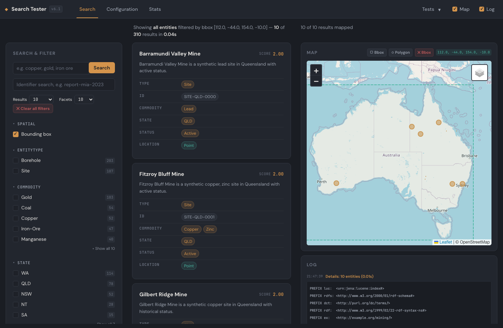

### Queensland bbox

- Query: `?filter={"op":"s_intersects","args":[{"property":"urn:jena:lucene:field#location"},{"bbox":[138,-29,154,-10]}]}`
- Results: **78 results**

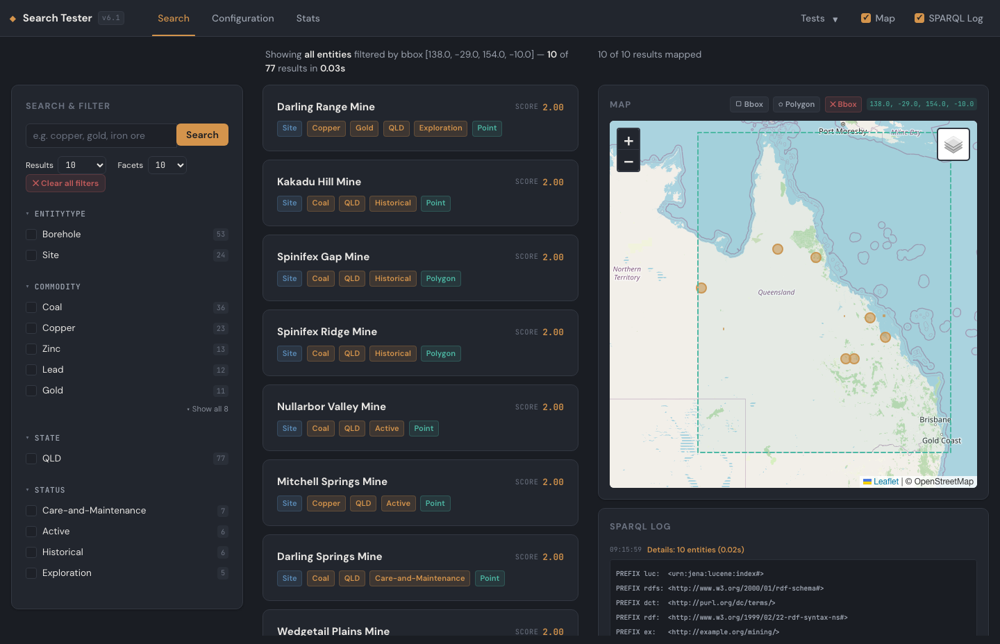

### Western Australia bbox

- Query: `?filter={"op":"s_intersects","args":[{"property":"urn:jena:lucene:field#location"},{"bbox":[112,-35,129,-14]}]}`
- Results: **114 results**

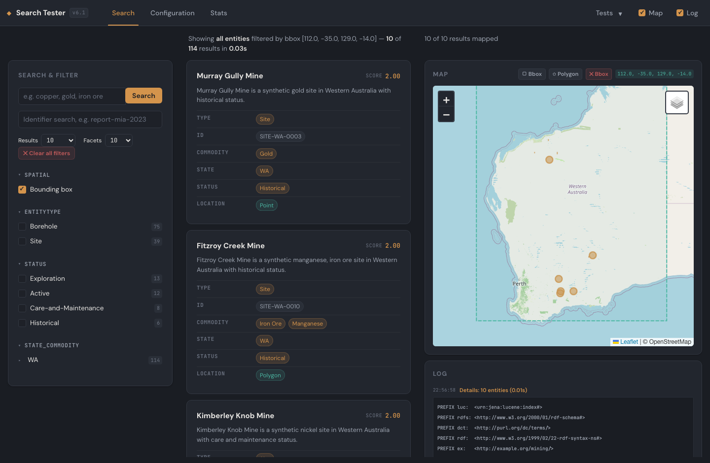

### Pilbara multipart bbox

- Query: `?q=Pilbara&filter={"op":"s_intersects","args":[{"property":"urn:jena:lucene:field#location"},{"bbox":[118.24,-22.28,118.28,-22.22]}]}`
- Results: **2 results**

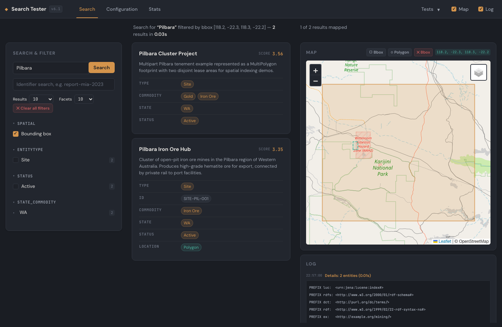

### NSW + SA bbox

- Query: `?filter={"op":"s_intersects","args":[{"property":"urn:jena:lucene:field#location"},{"bbox":[129,-38,154,-28]}]}`
- Results: **69 results**

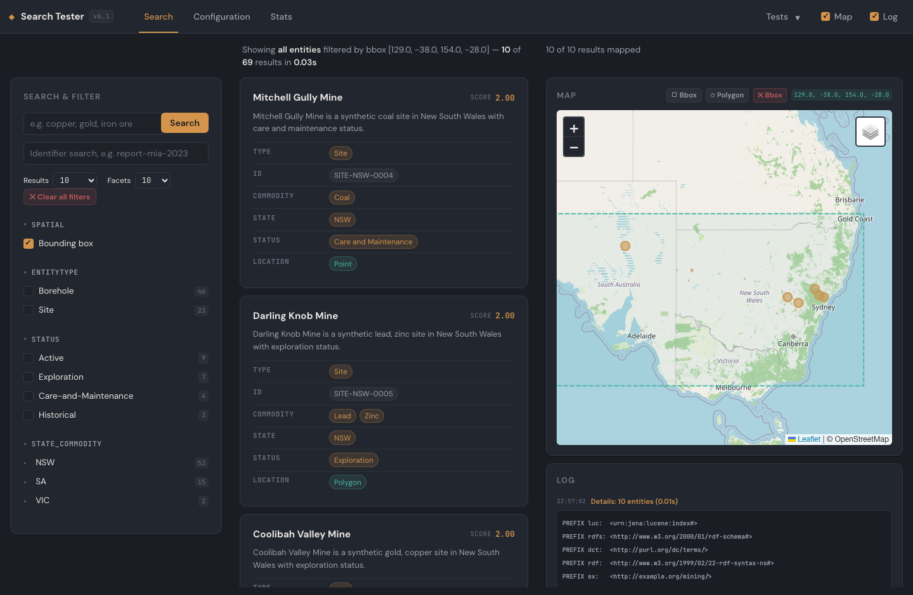

### Excludes PNG (Aus only)

- Query: `?filter={"op":"s_intersects","args":[{"property":"urn:jena:lucene:field#location"},{"bbox":[112,-44,154,-10]}]}`
- Results: **310 results**

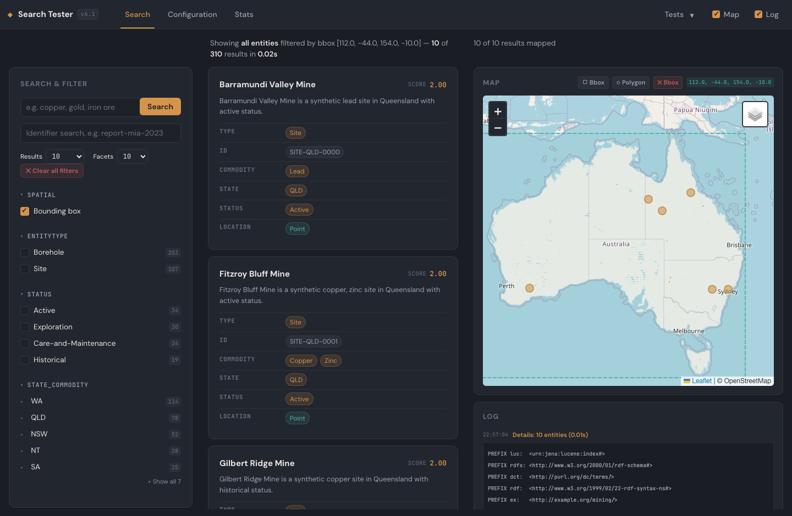

---

## Spatial: Polygon Filter

### Pilbara multipolygon lease A

- Query: `?filter={"op":"s_intersects","args":[{"property":"urn:jena:lucene:field#location"},{"type":"Polygon","coordinates":[[[118.20,-22.30],[118.30,-22.30],[118.30,-22.20],[118.20,-22.20],[118.20,-22.30]]]}]}`
- Results: **2 results**

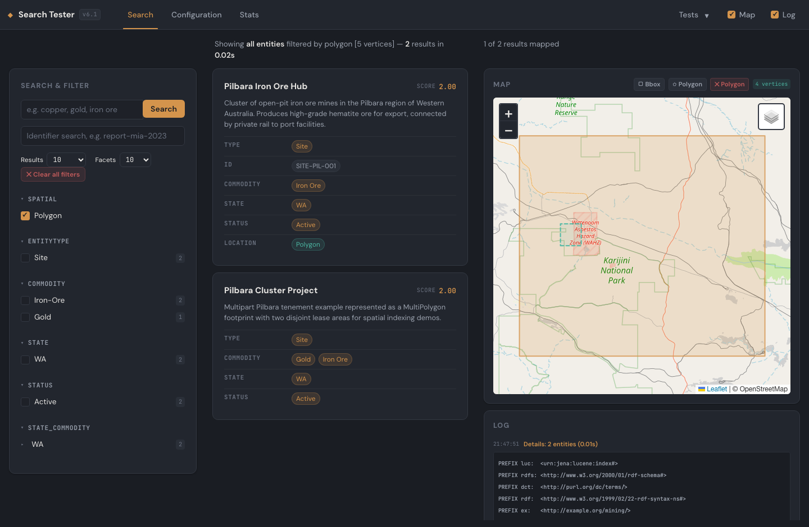

### Pilbara lease B + nearby points

- Query: `?filter={"op":"s_intersects","args":[{"property":"urn:jena:lucene:field#location"},{"type":"Polygon","coordinates":[[[118.45,-22.45],[118.55,-22.45],[118.55,-22.35],[118.45,-22.35],[118.45,-22.45]]]}]}`
- Results: **3 results**

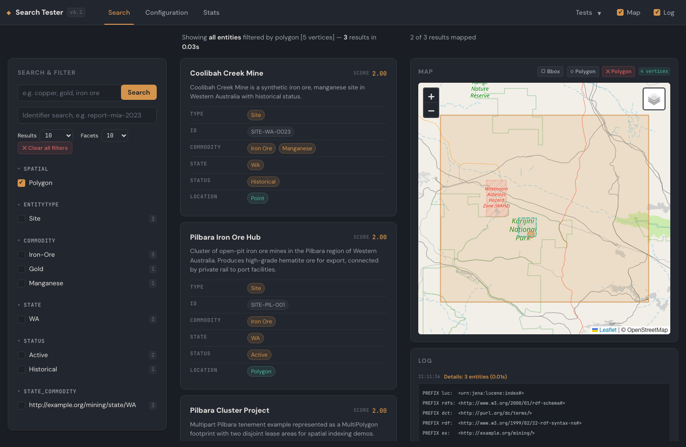

---

## Spatial + FTS

> Full-text search combined with spatial bounding box filter.

### "mine" in QLD bbox

- Query: `?q=mine&filter={"op":"s_intersects","args":[{"property":"urn:jena:lucene:field#location"},{"bbox":[138,-29,154,-10]}]}`
- Results: **27 results**

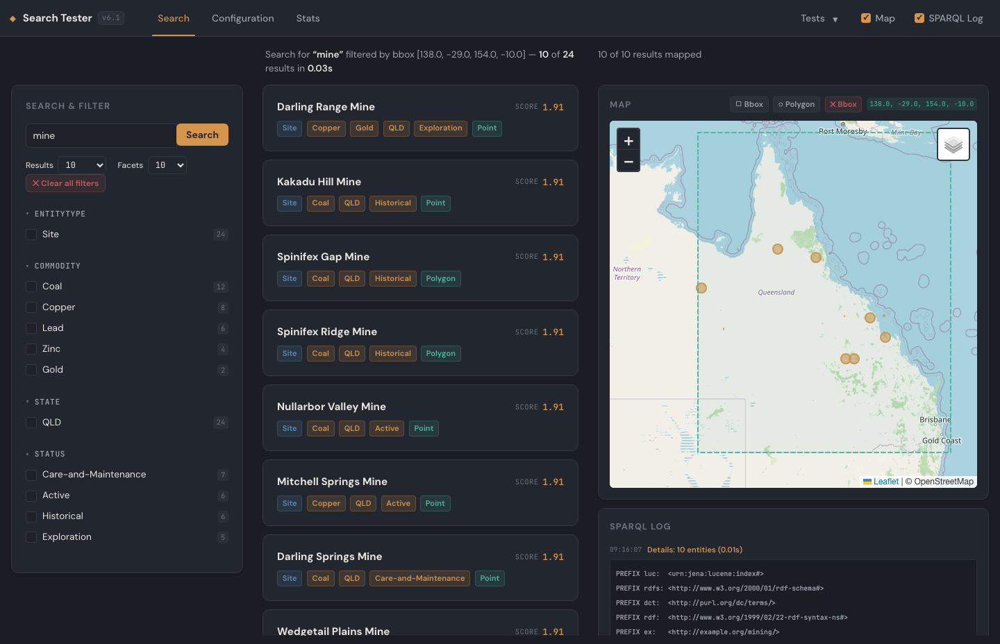

### "mine" in WA bbox

- Query: `?q=mine&filter={"op":"s_intersects","args":[{"property":"urn:jena:lucene:field#location"},{"bbox":[112,-35,129,-14]}]}`
- Results: **37 results**

---

## Spatial + Facets

> Facet filter combined with spatial bounding box filter.

### Sites in QLD bbox

- Query: `?filter={"op":"and","args":[{"op":"=","args":[{"property":"entityType"},"http://example.org/mining/Site"]},{"op":"s_intersects","args":[{"property":"urn:jena:lucene:field#location"},{"bbox":[138,-29,154,-10]}]}]}`
- Results: **27 results**

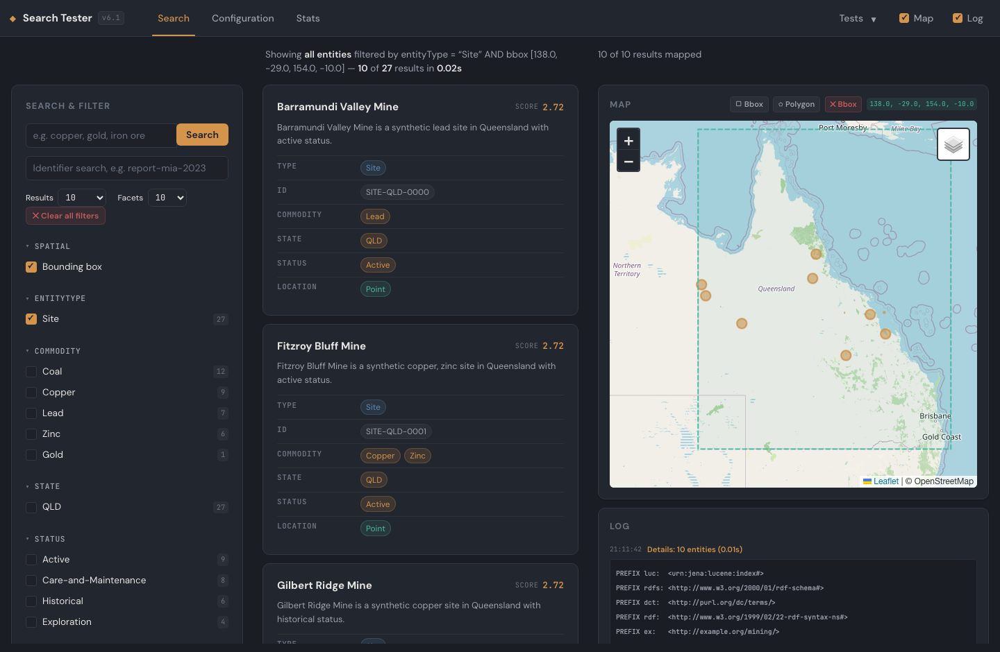

### Boreholes in WA bbox

- Query: `?filter={"op":"and","args":[{"op":"=","args":[{"property":"entityType"},"http://example.org/mining/Borehole"]},{"op":"s_intersects","args":[{"property":"urn:jena:lucene:field#location"},{"bbox":[112,-35,129,-14]}]}]}`
- Results: **75 results**

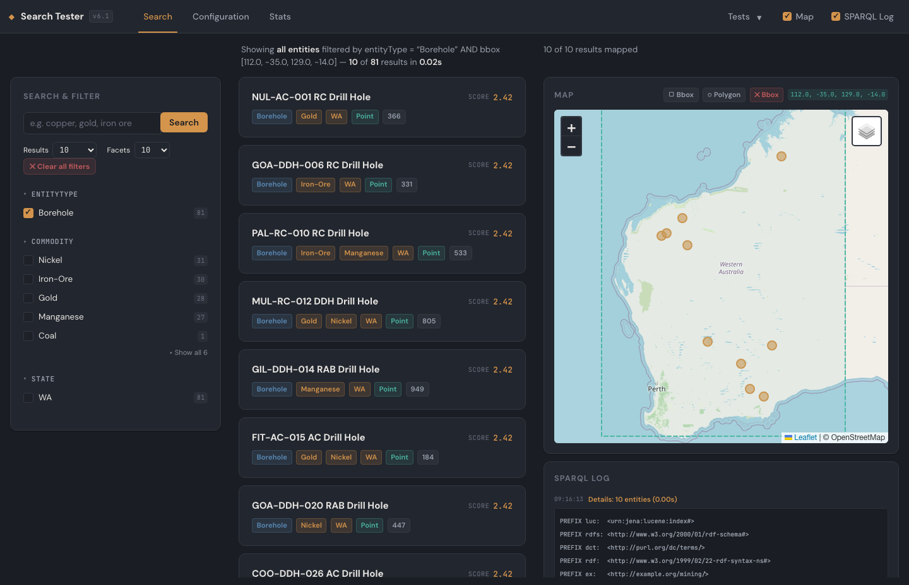

### Gold + Aus bbox

- Query: `?filter={"op":"and","args":[{"op":"=","args":[{"property":"commodity"},"http://example.org/mining/commodity/Gold"]},{"op":"s_intersects","args":[{"property":"urn:jena:lucene:field#location"},{"bbox":[112,-44,154,-10]}]}]}`
- Results: **103 results**

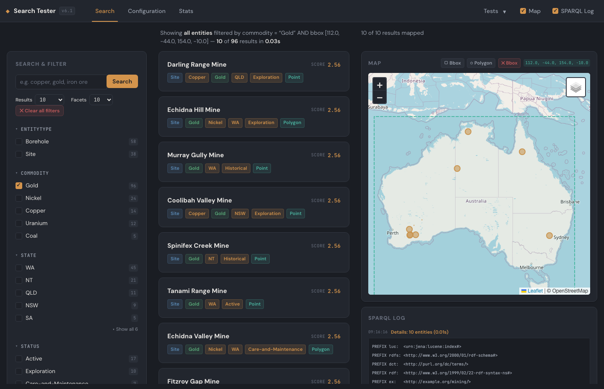

---

## Spatial + FTS + Facets

> All three combined: full-text + facets + spatial bbox.

### "mine" sites in QLD bbox

- Query: `?q=mine&filter={"op":"and","args":[{"op":"=","args":[{"property":"entityType"},"http://example.org/mining/Site"]},{"op":"s_intersects","args":[{"property":"urn:jena:lucene:field#location"},{"bbox":[138,-29,154,-10]}]}]}`
- Results: **27 results**

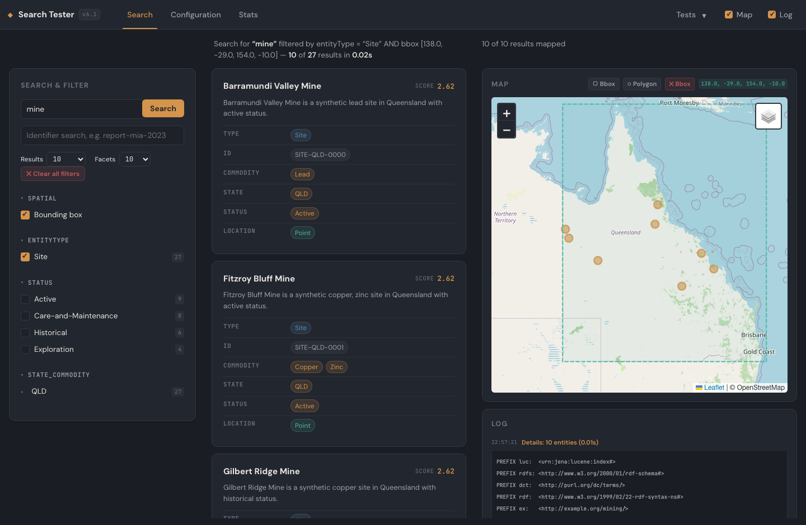

### "mine" in WA + state=WA bbox

- Query: `?q=mine&filter={"op":"and","args":[{"op":"=","args":[{"property":"state"},"http://example.org/mining/state/WA"]},{"op":"s_intersects","args":[{"property":"urn:jena:lucene:field#location"},{"bbox":[112,-35,129,-14]}]}]}`
- Results: **37 results**

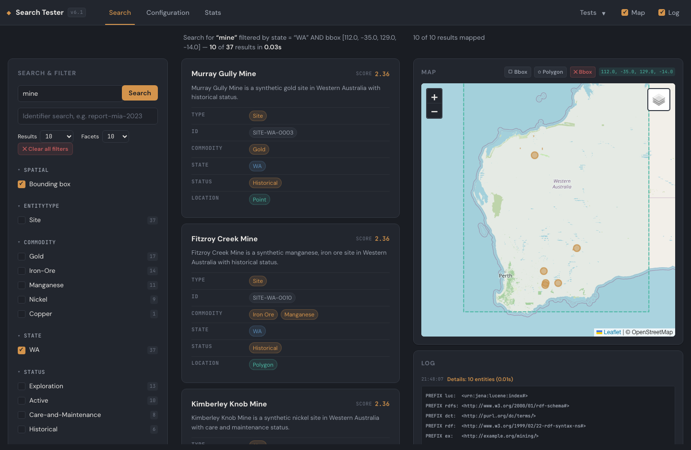

---

## Hierarchical Facets

### All entities (hierarchy visible)

- Query: `(no params)`
- Results: **524 results**

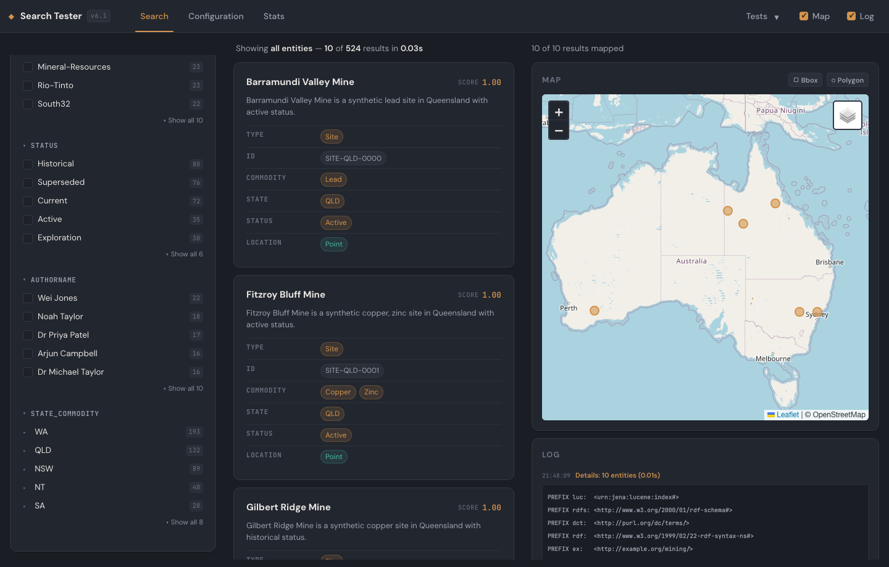

### "copper" (hierarchy with FTS)

- Query: `?q=copper`
- Results: **20 results**

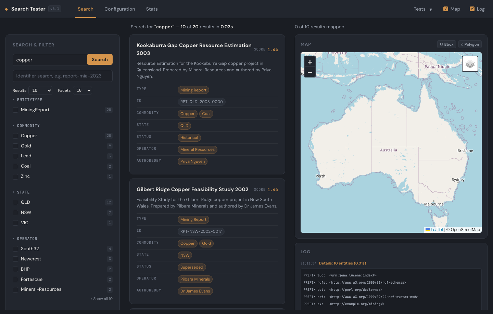

### Gold in WA (hierarchy + filters)

- Query: `?filter={"op":"and","args":[{"op":"=","args":[{"property":"commodity"},"http://example.org/mining/commodity/Gold"]},{"op":"=","args":[{"property":"state"},"http://example.org/mining/state/WA"]}]}`
- Results: **79 results**

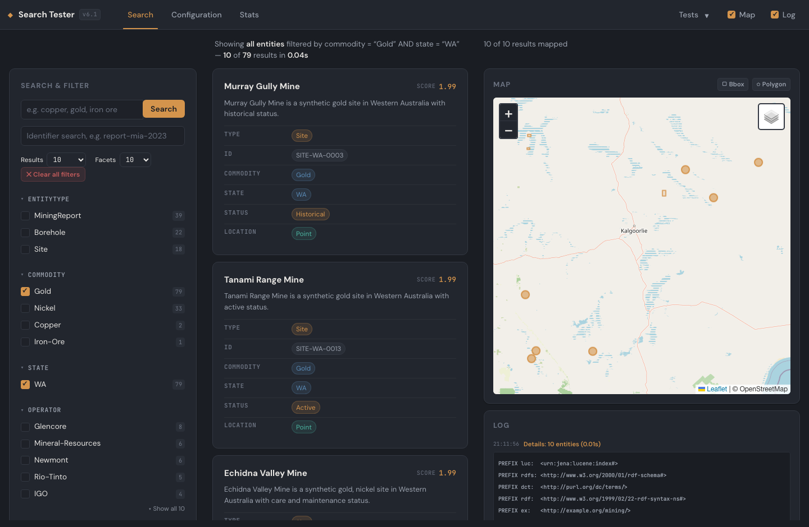

### Sites only (hierarchy + entity type)

- Query: `?filter={"op":"=","args":[{"property":"entityType"},"http://example.org/mining/Site"]}`
- Results: **108 results**

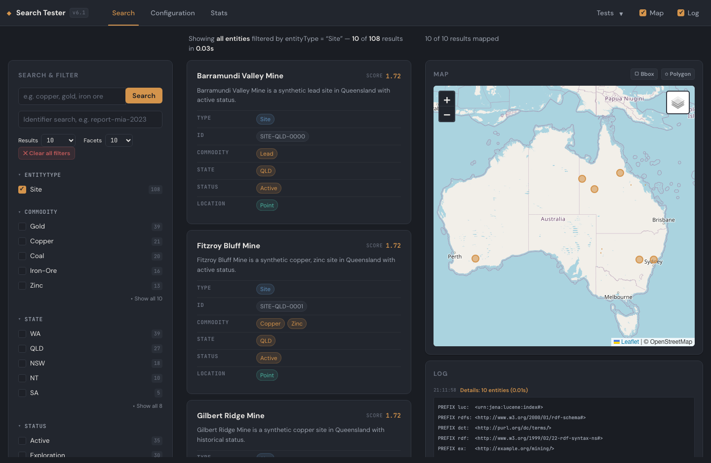

---
