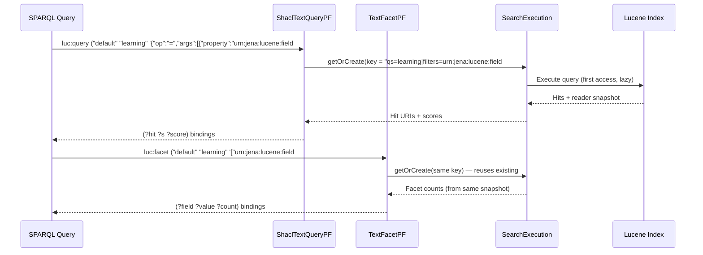
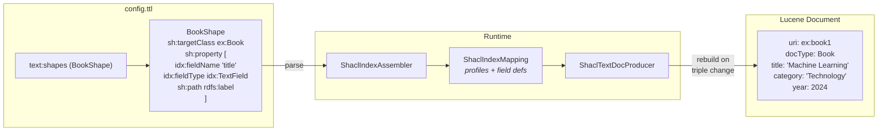

# Architecture

## Document Models

### Classic: Triple-Per-Document

The original `jena-text` model. Each RDF triple matching the entity map creates a separate Lucene document:

```
Triple: ex:book1 rdfs:label "Machine Learning"
  → Lucene doc: {uri: "ex:book1", text: "Machine Learning", lang: "en"}

Triple: ex:book1 ex:category "Technology"
  → Lucene doc: {uri: "ex:book1", category: "Technology"}
```

This is the upstream Jena text index, used with `text:entityMap` configuration and `text:query` for SPARQL search. No faceting support.

### SHACL: Entity-Per-Document

Introduced in Phase 2. Each entity (identified by `rdf:type` matching a shape's `sh:targetClass`) gets **one** Lucene document with all its fields:

```
Entity: ex:book1 (type ex:Book)
  → Lucene doc: {
      uri: "ex:book1",
      docType: "Book",
      title: "Machine Learning",
      category: "Technology",
      author: "Smith",
      year: 2024
    }
```

Used with `text:shapes` configuration. SPARQL search via `luc:query` (with filter support), facet counts via `luc:facet`.

**Advantages:**
- Single-pass faceting (text and facet fields on same document)
- Enables `DrillSideways` (future optimisation)
- Supports typed fields (int, long, double) for range queries
- Per-field configuration (stored, indexed, facetable, sortable)
- No overcounting from duplicate documents

---

## Key Classes

### Core (upstream, unmodified)

| Class | Role |
|-------|------|
| `TextQueryPF` | Implements `text:query` — upstream Jena text search property function |
| `EntityDefinition` | Maps RDF predicates to Lucene field names. Used by both modes |
| `TextIndexConfig` | Configuration holder passed to `TextIndexLucene` constructor |

### Core (extended)

| Class | Role |
|-------|------|
| `TextIndexLucene` | Central index implementation. Manages Lucene `IndexWriter`. Upstream methods unchanged; additive SHACL methods for faceting and entity document building |
| `Entity` | Represents a single indexable entity. `addValue()` supports multi-valued fields (additive) |

### SHACL Mode (all new files)

| Class | Role |
|-------|------|
| `ShaclIndexMapping` | Parsed data model: `IndexProfile` (shape), `FieldDef` (field), `FieldType` enum. Pure data, no RDF/Lucene dependencies beyond `Node` and `Analyzer` |
| `ShaclTextDocProducer` | Change listener. On triple add/delete, reads entity state from `MultiUnion(defaultGraph, unionGraph)`, builds Entity, calls `updateEntityForProfile()`. Supports data in default and named graphs |
| `ShaclTextQueryPF` | Implements `luc:query` — search with JSON filter support, `?totalHits` binding. Uses `SearchExecution` for shared state with `luc:facet` |
| `TextFacetPF` | Implements `luc:facet` — facet counts property function. Returns (field, value, count) bindings |
| `SearchExecution` | Shared execution state. Stored in `ExecutionContext` keyed by normalised query params. Lazy-computes hits, facet counts, and total hit count |
| `FacetValue` | Immutable (value, count) pair for facet results |
| `ShaclIndexAssembler` | Parses `text:shapes` RDF config into `ShaclIndexMapping`. Reads `sh:targetClass`, `sh:path`, `sh:alternativePath`. No jena-shacl dependency |
| `ShaclTextIndexLucene` | Extended `TextIndexLucene` with taxonomy writer/reader for hierarchical facets, `MultiFacets`, and `extractHierarchyDrillDown()` |
| `IndexVocab` | `urn:jena:lucene:index#` namespace constants and PF URI strings |

### Assembler (minimally extended)

| Class | Role |
|-------|------|
| `TextIndexLuceneAssembler` | Builds `TextIndexLucene` from TTL config. Additive: detects `text:shapes` alongside existing `text:entityMap` path |
| `TextDatasetAssembler` | Builds text-indexed dataset. Additive: auto-creates `ShaclTextDocProducer` in SHACL mode |

---

## Shared Execution Flow

When `luc:query` and `luc:facet` appear in the same SPARQL query:



Both PFs build a normalised key from query parameters. `SearchExecution.getOrCreate()` stores/retrieves shared state in `ExecutionContext`.

Key normalisation: property URIs are sorted, filter map keys are sorted, filter values within each key are sorted. This ensures the same logical query always produces the same key regardless of argument ordering.

---

## SHACL Change Listener Flow

`ShaclTextDocProducer` handles all triple changes. The base dataset is always up-to-date when `change()` fires because `DatasetGraphTextMonitor` calls `super.add()` before `record()`.

The producer reads entity data from a `MultiUnion` graph combining the default graph and the union of all named graphs. This ensures entities are indexed regardless of whether data is loaded into the default graph or named graphs (e.g. N-Quads with `tdb2:unionDefaultGraph`).

### Indexing flow from config to Lucene document



### Change listener detail

```
DatasetGraphTextMonitor.add(g, s, p, o)
  ├── super.add(g, s, p, o)        ← base dataset updated FIRST
  └── record() → change(ADD, g, s, p, o)
        │
        ShaclTextDocProducer.change()
        ├── p == rdf:type?
        │     └── handleTypeChange()
        │           └── rebuildEntityDocuments(s)
        ├── mapping.isRelevantPredicate(p)?
        │     ├── top-level predicate?
        │     │     └── rebuild entity subject directly
        │     ├── nested child predicate?
        │     │     └── reverse nested join path from changed child node
        │     └── nested join predicate?
        │           └── locate join step, reverse join-path prefix to parent
        └── else: ignore (irrelevant predicate)

rebuildEntityDocuments(subject)
  ├── getAllGraph() → MultiUnion(defaultGraph, unionGraph)
  ├── Read rdf:type values from combined graph
  ├── Find matching IndexProfiles via classLookup
  ├── If no profiles match → deleteEntityByUri()
  └── For each matching profile:
        ├── Read all relevant triples from combined graph
        ├── Build Entity with addValue() for each field
        └── indexer.updateEntityForProfile(entity, profile)
              ├── docFromMapping() → builds typed Lucene Document
              ├── Delete existing doc by (uri + docType) composite query
              └── Add new document
```

---

## Hierarchical and Nested Facets Architecture

### Data Model

`HierarchyDef` (inner class of `ShaclIndexMapping`) represents a hierarchy dimension:
- `dimensionName` — auto-generated from level field names joined with `_` (e.g., `state_commodity`)
- `levels` — ordered list of `FieldDef` references (index 0 = parent, 1 = child, etc.)
- `getDepth()`, `getLevelIndex(field)`, `getLevel(i)` — navigation methods

`NestedDef` represents a repeated correlated child collection:
- `nestedName` — the child scope identifier derived from `idx:joinPath`
- `joinPath` — the SHACL path used to enumerate child nodes
- `joinSteps` — the ordered forward/inverse predicate steps used for change monitoring
- `joinPredicates` — the predicate set used for change monitoring
- `fields` — child-scoped `FieldDef` references
- `hierarchies` — hierarchy dimensions declared inside that nested block

`FieldDef` now carries explicit scope metadata:
- root fields have `nestedName = null`
- child fields have `nestedName = <joinPath>`

This allows the runtime to distinguish:
- root fields evaluated from the entity node
- child fields evaluated from the nested join node

Hierarchies are declared either:
- per-shape via shape-level `idx:facetHierarchy`, or
- per-child-collection via `idx:nested / idx:facetHierarchy`

### Indexing

Hierarchical fields use Lucene's taxonomy API (`DirectoryTaxonomyWriter/Reader`). `ShaclTextIndexLucene` maintains a separate taxonomy directory alongside the main index.

During document building:

- root hierarchies use ordinary entity field values
- nested hierarchies iterate child records first, then emit one `FacetField` path per child record

Direct hierarchy example:
```
FacetField("state_commodity", "WA", "Gold")
```

Nested identifier example:
```
FacetField("identifierType_identifierValueExact", "Company", "Glencore")
FacetField("identifierType_identifierValueExact", "HoleNumber", "MIA-DDH-001")
```

`FacetsConfig` is configured with `setHierarchical(true)` and `setMultiValued(true)` for each dimension.

Nested fields are also flattened onto the parent Lucene document in Phase 1 so ordinary search and typeahead can still target them without block join. This flattening applies to both keyword and text child fields.

### Query-Time Behavior

There are two hierarchy-related query paths:

1. `CqlToLuceneCompiler` folds contiguous `=` comparisons on hierarchy levels into a `DrillDownQuery`.
   Example: `type = Mineral AND subtype = Gold` becomes one hierarchy path query on `type_subtype`.
2. `extractHierarchyDrillDown()` in `ShaclTextIndexLucene` derives drill-down paths for facet counting from `=` filters when the client is requesting hierarchy counts.

This gives correct exact-match semantics for:

- direct hierarchies
- nested hierarchies when the query anchors the path from level 0 downward
- bare `=` filters on level-0 hierarchy fields

Phase 1 limitation:

- non-folded child-field queries still run against flattened parent fields
- this includes lone leaf filters, `OR`/`NOT`, and child numeric/range filters
- child text + sibling child filter correlation still requires a later block-join execution layer

That Phase 1 parent flattening is now part of the forward-compatibility contract. When block join lands, parent-flattened child fields either need to remain available or become an explicit opt-in compatibility mode so existing child-field filters do not silently change meaning.

`collectFacetResults()` uses `FastTaxonomyFacetCounts` for hierarchy dimensions and `SortedSetDocValuesFacetCounts` for flat facets. `MultiFacets` combines both into a unified result map. Result keys use the child level field name (not the dimension name) so that `generateBindings()` returns proper field IRIs.

### Field IRI Resolution

`resolveFacetFieldNames()` auto-detects when a requested field IRI belongs to a hierarchy. It maps the field to the dimension name so the `MultiFacets` dispatch works correctly. Requesting `field#state` (level 0) returns top-level values; requesting `field#commodity` (level 1) with a parent filter returns child values.

### Change Monitoring

`ShaclTextDocProducer` treats predicates in three buckets:

- root-field predicates rebuild the entity directly
- nested child predicates rebuild parent entities by reversing the nested join path from the changed child node
- nested join predicates rebuild parent entities by locating the changed join step, then reversing the join-path prefix back to the parent

Reverse parent lookup currently supports `idx:joinPath` values made from:

- simple predicate steps
- inverse predicate steps
- sequences composed from those steps

Alternative join paths are still rejected for `idx:joinPath`.

### Key Classes

| Class | Hierarchy Role |
|-------|---------------|
| `ShaclIndexMapping.HierarchyDef` | Data model for hierarchy dimensions |
| `ShaclIndexMapping.NestedDef` | Data model for repeated child collections |
| `ShaclTextIndexLucene` | Taxonomy writer/reader lifecycle, direct vs nested hierarchy indexing, `extractHierarchyDrillDown()`, `MultiFacets` |
| `ShaclEntityBuilder` | Builds root fields plus nested child records from graph data |
| `CqlToLuceneCompiler` | Folds exact hierarchy filters into `DrillDownQuery` |
| `ShaclIndexAssembler` | Parses `idx:facetHierarchy`, `idx:nested`, `idx:joinPath`, and scoped fields |
| `TextFacetPF` | Passes resolved facet fields and CQL through to index |

---

## Range Facets Architecture

### Design

Range facets are integrated into the existing `luc:facet` property function rather than a separate PF. The `facetFields` JSON array accepts both plain field IRI strings (for flat/hierarchical facets) and range specification objects (for numeric bucketed counts).

Public result shapes:

- flat and hierarchical facets may continue to use the legacy 3-slot form: `(?field ?value ?count)`
- any request containing a range object uses the 5-slot form: `(?field ?value ?low ?high ?count)`
- mixed flat + range requests also use the 5-slot form

### Lucene Integration

Range facets use a different Lucene API from flat facets:

| Facet type | Lucene API | Data source |
|-----------|-----------|-------------|
| Flat (KEYWORD) | `SortedSetDocValuesFacetCounts` | `SortedSetDocValuesFacetField` |
| Hierarchical | `FastTaxonomyFacetCounts` | `FacetField` (taxonomy) |
| Range (INT/LONG) | `LongRangeFacetCounts` | `SortedNumericDocValuesField` + `MultiLongValuesSource` |
| Range (DOUBLE) | `DoubleRangeFacetCounts` | `SortedNumericDocValuesField` + `MultiDoubleValuesSource.fromField(..., NumericUtils::sortableLongToDouble)` |

All three facet types share the same search collection step. After collection, flat facets query SSDV structures, hierarchical facets query the taxonomy index, and range facets query numeric docvalues with caller-specified bucket boundaries. For `DOUBLE`, the sorted numeric docvalues are stored in sortable-long form for sorting, then decoded back to doubles for range aggregation.

The important design point is that range boundaries are not part of the search itself. Shared execution is keyed by search parameters, while facet request details such as range boundaries are applied after shared collection.

### Boundary Semantics

Boundaries use the histogram bin-edge convention: contiguous, lower-inclusive, upper-exclusive `[low, high)`. This matches Lucene's `LongRange`/`DoubleRange` constructors, Solr, Elasticsearch, and numpy/pandas.

Open-ended ranges are represented by `null` sentinels in the boundary array, which map to `Long.MIN_VALUE`/`Long.MAX_VALUE` (or `Double` equivalents) in the Lucene range objects.

The public SPARQL output for a range bucket is explicit bounds, not a display label. Range rows bind `?low` and `?high` as typed numeric literals; open-ended buckets leave the missing bound unbound.

### Validation

- A numeric field (INT/LONG/DOUBLE) appearing as a bare string in the facet fields array produces an error; numeric facets require explicit range boundaries
- The wildcard `"*"` expands to flat and hierarchical fields only — range facets require explicit boundaries
- Range objects targeting non-numeric fields (KEYWORD/TEXT/LATLON) produce an error
- Mixed flat + range requests require the 5-slot `luc:facet` subject form

### Key Classes

| Class | Range Facet Role |
|-------|-----------------|
| `TextFacetPF` | Parses mixed facet fields array — detects objects vs strings, extracts `RangeFacetSpec` |
| `ShaclTextIndexLucene` | Writes numeric docvalues, performs numeric sort selection, and computes range buckets after shared search collection |
| `SearchExecution` | Shares search state by search parameters only; caches facet results per facet request |

---

## Lucene Field Mapping (SHACL Mode)

| FieldType | Lucene indexed field | Lucene stored field | Lucene DocValues |
|-----------|---------------------|--------------------|--------------------|
| TEXT | `TextField` | (via `TYPE_STORED`) | — |
| KEYWORD | `StringField` | (via `Store.YES`) | `SortedSetDocValuesFacetField` (facetable), `SortedDocValuesField` (sortable) |
| INT | `IntPoint` | `StoredField(int)` | `SortedNumericDocValuesField` (facetable and/or sortable) |
| LONG | `LongPoint` | `StoredField(long)` | `SortedNumericDocValuesField` (facetable and/or sortable) |
| DOUBLE | `DoublePoint` | `StoredField(double)` | `SortedNumericDocValuesField` (facetable and/or sortable) |

Each entity document also gets:
- **URI field** (`ftIRI` type) — tokenized=false, stored=true
- **Discriminator field** — `StringField` with the target class local name (e.g., "Book")

---

## Performance Characteristics

### SortedSetDocValues Faceting

The SHACL mode uses Lucene's `SortedSetDocValuesFacetCounts` for facet counting:

- **O(1) counting** — uses pre-built DocValues structures, not document iteration
- **~25% more indexing time** compared to non-faceted fields (DocValues must be built at write time)
- **Memory overhead** — ~10-20 bytes per unique value per facetable field in the DocValues segment
- **High cardinality caution** — fields with very many unique values (e.g., URIs) can consume significant memory during facet collection. Use `text:maxFacetHits` to limit the search scope if needed.

### Best Practices

1. **Only enable faceting on fields you'll facet on** — set `idx:facetable true` selectively on KEYWORD and numeric fields
2. **Use `maxValues`** — don't request more facet values than the UI needs
3. **Use `minCount`** — exclude rare values to reduce result size
4. **Index rebuild required** — changing `idx:facetable`, `idx:sortable`, or `idx:multiValued` on a faceted/sortable field requires a full reindex since DocValues are built at write time
5. **`text:maxFacetHits`** — for large indexes, set this assembler property to cap the number of documents searched during facet collection. `0` (default) means unlimited.

### Entity Rebuild Cost

In SHACL mode, any relevant triple change triggers a full entity document rebuild. This reads all triples for the entity from the base dataset and replaces the Lucene document. For typical entities (< 50 triples), this is fast. For entities with hundreds of triples, this may be noticeable during high-frequency updates.

---

## Backward Compatibility

All changes are purely additive. The upstream Jena `jena-text` code paths are unmodified:

- `TextQueryPF` — upstream `text:query` implementation, unchanged
- `TextIndexLucene` core methods (`doc()`, `addDocument()`, `updateDocument()`) — unchanged
- `TextIndexLuceneAssembler` — `text:entityMap` path unchanged; `text:shapes` is an additive alternative
- `TextDatasetAssembler` — SHACL producer wiring only activates when `isShaclMode()` is true

New code lives in separate classes (`ShaclTextQueryPF`, `TextFacetPF`, `ShaclTextDocProducer`, etc.) and registers under the `luc:` namespace (`urn:jena:lucene:index#`), not the `text:` namespace.
